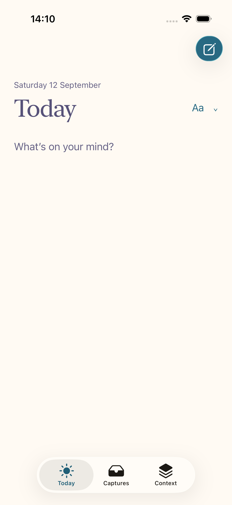
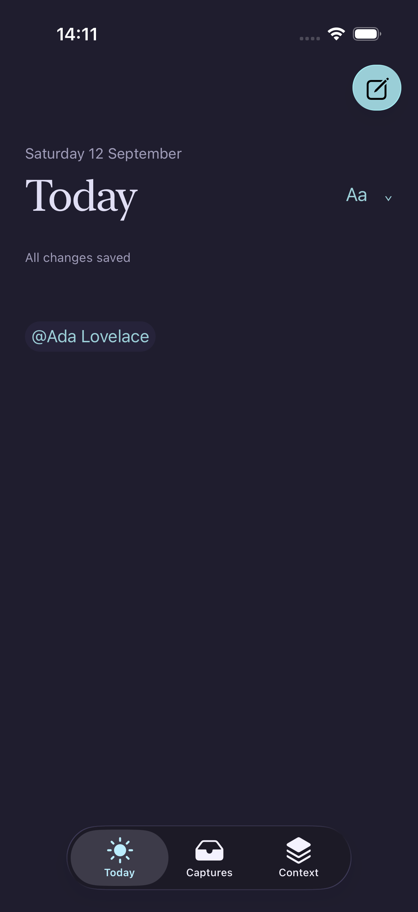
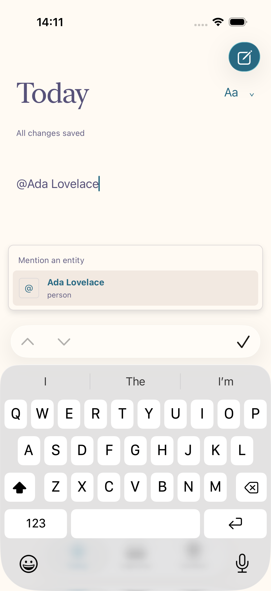

# Dedicated Apple editor qualification — 12 September 2026

Today now loads the shared editor through `/apple/editor`. The route removes
website navigation, duplicate Today labels, desktop file actions, and the
permanent formatting toolbar. Native navigation remains SwiftUI; the document
uses the selected Rosé Pine Dawn or Dark canvas. Formatting opens from the
compact Aa disclosure beside the title. Device-only notes remain available under
Context → On this device.

## Evidence

- `deno task verify` passed formatting, lint, Worker checks, Astro/Vue checks,
  and the full registered test suite. The final route check passed with zero
  diagnostics after tightening document-pane parsing.
- The website production build and authenticated dense runtime fixture passed.
- iOS and Mac builds passed using Xcode 27 with OS 26 deployment minimums.
- Eight native iPhone UI journeys passed: calendar/event detail, capture
  persistence, immediate local daybook relaunch, blank capture rejection, empty
  initial state, palette persistence, person detail, and repository timeline
  filtering.
- Four final editor UI journeys passed with zero failures on iPhone 17 Pro
  Simulator: one document heading/no desktop chrome (including Aa placement),
  slash-command heading insertion, mention suggestions/insertion/save/relaunch
  and linked entity navigation, and Dark palette navigation/relaunch.
- Screenshots below were exported from those XCTest runs and visually inspected.
  They use the actual app and an authenticated local server fixture, not mockups
  or live account data. The mention menu remains visible above the keyboard.
- Independent read-only integration review caught a formatting-control anchor
  that could overlap document text; the final placement and test correct it.

Machine-local evidence: `/tmp/apsides-editor-qualified.xcresult` (four final
editor tests), `/tmp/apsides-editor-final-tests.xcresult` (eight native journeys
passed; an earlier mention assertion was corrected in the final run), and
`/tmp/apsides-editor-verify.log` (shared verification).

## Screenshots

| Dawn                                               | Dark                                               |
| -------------------------------------------------- | -------------------------------------------------- |
|  |  |

## Deployment and remaining qualification

This update has not been deployed or installed on the physical phone. The
production dry-run stopped during 1Password authorization before producing a
resource plan. No production resources changed. Once credentials are available,
review the complete Alchemy production plan before applying it. The native host
checks the editor route version and shows an update message if the deployed
website lacks this route, rather than displaying the desktop website.

The previous phone installation is not evidence for this new UI. Real-device
provider sign-in, interrupted saves, network loss, selected-text Supertags,
VoiceOver/large text, iPad and Mac visual qualification still need coverage. The
connected web editor has no bundled offline recovery; native capture remains
available offline. The physical Watch provisioning defect and absence of a
CarPlay launcher app remain as documented in DEVICE-INSTALL-DIAGNOSIS.md and
CARPLAY-TEST.md. This PR remains a development draft.
