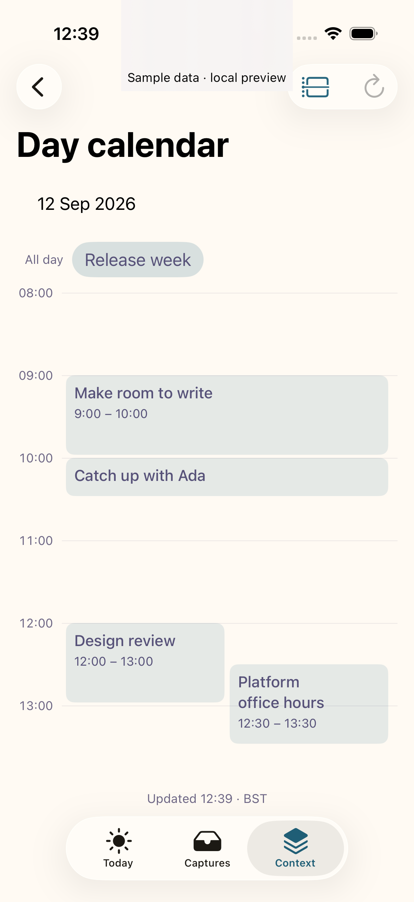
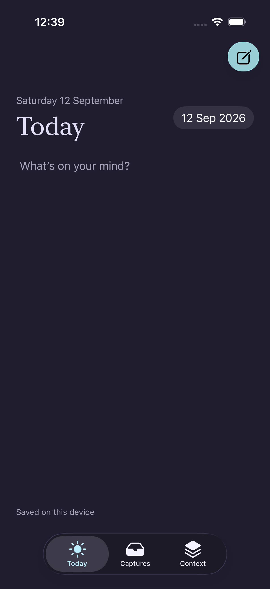
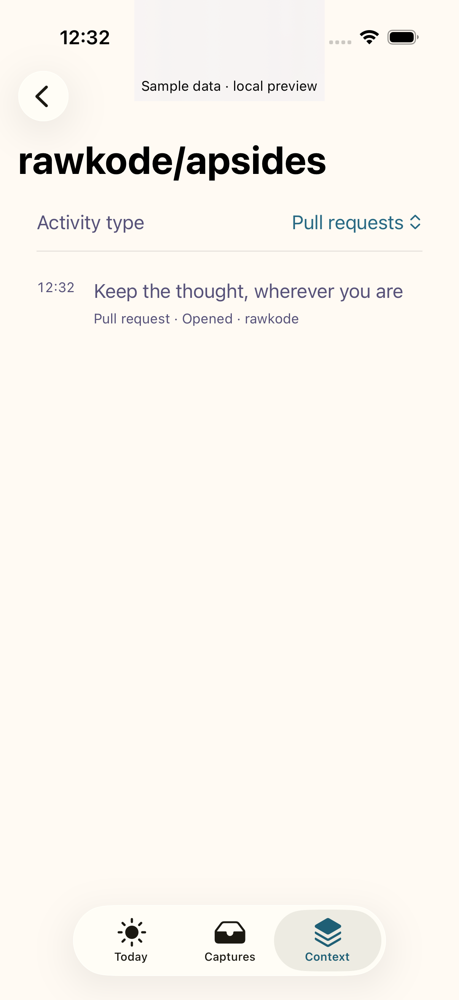
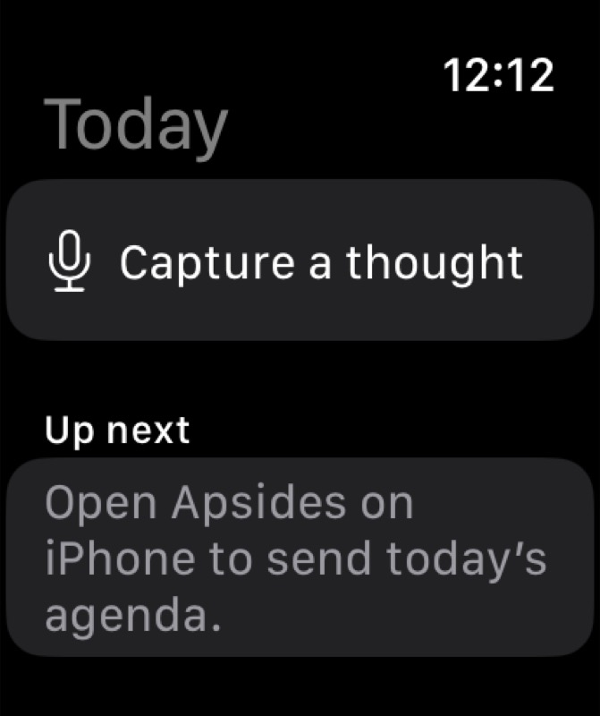

# Native runtime screenshots

Captured from the built app on iOS/iPadOS 26.5 and watchOS 26.2. Calendar and
GitHub data are explicitly labelled sample context. These are not design
mockups.

A final Mac screenshot is pending because the Mac locked during QA. See the
[verification record](../VERIFICATION.md) for checks and release limitations.
