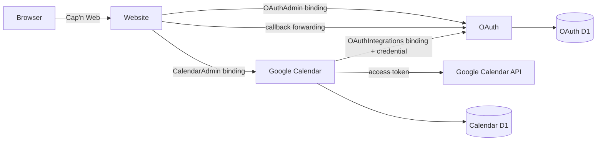

# Enchiridion

Bun workspace with an Astro website, an OAuth Worker, and a Google Calendar Worker. Each service owns its database. The website has no direct access to either D1 database.

## Run locally

```sh
bun install
bun dev
```

The first run generates ignored development secrets, applies both local D1 migrations, and starts:

| Component | Address |
| --- | --- |
| Website and admin | http://localhost:4321/admin/oauth |
| OAuth Worker | http://localhost:8787/health |
| Google Calendar Worker | http://localhost:8788/health |
| Local Google test provider | http://127.0.0.1:8790/health |

Create a Google Calendar app with any non-empty client ID and secret, connect the test account, and grant `google-calendar` access. Open Google Calendar and choose **Sync calendar**. This exercises browser authorization, RPC, the token broker, and D1 sync with sample responses. It does not contact Google or require a Cloudflare account.

Ctrl+C stops the stack, including Astro's background server. Databases and encryption keys persist. Test-provider tokens are in memory, so reconnect test accounts after restarting it.

All JavaScript commands use Bun, including Astro, Wrangler, tests, and browser automation. Wrangler launches Cloudflare's `workerd` binary for local Workers and D1. `scripts/cloudflare-bun.ts` loads installed Undici and ws implementations because Bun's built-in replacements lack dispatcher methods and WebSocket events needed by Miniflare. There is no Node runtime fallback.

## Verify

```sh
bun test
bun run check
bun run build
```

With `bun dev` running in another terminal:

```sh
bun x --bun playwright install chromium
bun run test:e2e
```

E2E uses the real local Workers, service bindings, two D1 databases, and admin UI. It creates/reuses `Local test calendar`, connects a test account, syncs paginated events, checks incremental updates/deletions, recovers from an expired cursor, and checks grant revocation, CSRF rejection, private RPC, and mobile layout. It leaves the sample connected for inspection. Screenshots go to ignored `test-results/`.

Unit tests execute the actual migrations and SQL through Bun SQLite and a local HTTP provider. They additionally cover encryption, key rotation, OAuth state/PKCE/nonce, browser binding, permissions, concurrent refresh, refresh-token rotation, revoked grants, and atomic sync failures. This does not establish live Google or production acceptance.

Run build/check before starting development; concurrent Astro build/check commands can invalidate Vite's active development cache. Restart `bun dev` if that happens.

## Use your real Google account

Stop the local stack, then run:

```sh
bun run dev:google
```

This selects Google's endpoints and starts the same three services without the mock. Existing encryption keys and integration credentials are preserved.

1. Enable Google Calendar API (or Gmail API) in Google Cloud.
2. Configure the consent screen; add your account as a test user if the app is in testing.
3. Create an OAuth client of type **Web application**.
4. Add the exact redirect URI `http://localhost:4321/oauth/callback/google`.
5. Register a new app in the admin UI with these real credentials, connect your account, grant `google-calendar` access, and sync.

The service requests offline access. Google testing-mode limits and revocation can expire refresh tokens, requiring reconnection. Public Gmail apps may need Google's verification. See [Google's OAuth guide](https://developers.google.com/identity/protocols/oauth2/web-server).

To switch back, stop the stack and run `bun run dev:setup`, then `bun dev`.

## Ownership and RPC



Shared contracts live in `packages/oauth-client`. OAuth owns apps, encrypted client secrets, one-time authorization sessions, account connections, encrypted access/refresh tokens, and integration grants. Calendar owns events, staging rows, and incremental cursors. Calendar never receives a refresh token or client secret.

`OAuthAdmin` and `OAuthIntegrations` are separate, private named Worker entrypoints. Both expose Cap'n Web HTTP through their `fetch` handlers and return the same `RpcTarget` capabilities through [interoperable Workers RPC](https://capnweb.com/guides/workers-rpc/). The website forwards browser batches with a verified owner identity. OAuth's default entrypoint serves callbacks and health only; it exposes no public admin/token API.

For another integration, bind to `enchiridion-oauth` with entrypoint `OAuthIntegrations`:

```ts
import { connectOAuth } from '@enchiridion/oauth-client';

using oauth = await connectOAuth(env.OAUTH, env.OAUTH_SERVICE_CREDENTIAL);
const connections = await oauth.listConnections(); // Explicit grants only.
const token = await oauth.getAccessToken(connectionId, [
  'https://www.googleapis.com/auth/calendar.readonly',
]);
// Use token.accessToken only on the server, at the intended provider.
```

Store the SHA-256 hash of its unique credential in OAuth's `SERVICE_CREDENTIALS` secret, a JSON object keyed by service ID. Store the plaintext only as a secret in the requesting integration. Its ID then appears in the admin grant selector. A grant covers the connection's entire scope set. `requiredScopes` verifies suitability; it does not downscope Google's bearer token. Use separate OAuth apps for different permissions.

Calendar, Mail, and Drive have presets; Google custom scopes are supported. New providers require trusted endpoints and provider-specific handling/tests in `services/oauth/src/providers.ts` and callback routing. Arbitrary endpoint URLs cannot be registered over RPC.

## Deployment

Local commands and `bun run build` create no remote resources. Before deployment:

- Create three D1 databases (OAuth, Google, Documents) and replace each service's placeholder `database_id`. Apply remote migrations with `bun run db:migrate:remote` from each service directory.
- Set `WEBSITE_ORIGIN` to the same exact HTTPS website origin in website and OAuth configuration.
- Protect the website, including `/`, `/today`, `/admin/*`, and `/api/*`, with Cloudflare Access. Set website `ACCESS_TEAM_DOMAIN`, `ACCESS_AUDIENCE`, and comma-separated `ADMIN_EMAILS`. The website verifies JWT signatures, issuer, audience, expiry, and admin allowlist. Keep the OAuth callback publicly reachable.
- Set OAuth secrets `TOKEN_ENCRYPTION_KEYS` (JSON key ID to base64-encoded 32-byte key), `TOKEN_ENCRYPTION_KEY_ID` (active ID), and `SERVICE_CREDENTIALS` (JSON service ID to SHA-256 hash). Keep old encryption keys while ciphertext references them. Set Calendar's `OAUTH_SERVICE_CREDENTIAL`. Use `bun x --bun wrangler secret put NAME` in each service directory.
- Never configure `LOCAL_PROVIDER_ORIGIN` or `LOCAL_ADMIN_EMAIL` in production. Local admin also requires an Astro development build and a matching HTTP loopback origin, so production builds reject the bypass.
- Deploy OAuth, Calendar, Documents, then the website using their Bun `deploy` scripts. Only trusted servers receive `OAuthAdmin`, `CalendarAdmin`, and `Documents` bindings; integrations receive `OAuthIntegrations`.

Secrets and tokens use AES-256-GCM with row/field identity as authenticated data. D1 leases and version fencing protect refresh concurrency. Disconnect deletes OAuth credentials and grants and blocks new token requests. Issued tokens remain valid until expiry. Disconnect does not revoke at Google or delete an integration's independently owned data. Calendar hides cached data immediately after its grant is removed. Revoke provider access through Google account permissions when needed.

Calendar syncs the primary calendar, storing recurring series and exceptions rather than expanding infinite recurrence. It handles pagination, incremental changes, cancellations, and HTTP 410 expiry following [Google's sync protocol](https://developers.google.com/workspace/calendar/api/guides/sync). Staging and atomic D1 publication prevent partial syncs. The admin shows the first 500 stored events. A production cron runs every 15 minutes; trigger local cron events using Wrangler's `/cdn-cgi/local/scheduled` endpoint.

Multi-calendar selection, push notifications, provider-side revocation, credential editing, and retained-calendar deletion policies are outside this initial implementation.
# Google worker: contacts, calendars, and live Gmail

## Today and documents

The default website page is a writing-first Today workspace with a persistent Loro/TipTap daily note, upcoming events, people, and an honest unconfigured weather slot. Documents live in their own Worker and D1. Trusted, versioned extension adapters supply lazy-loaded D2 and Excalidraw editors; unknown blocks preserve their payloads when an adapter is unavailable.

See [Documents and Today architecture](docs/documents-and-today.md) for extension registration, slot composition, conflict/recovery semantics, and current limits. With `bun run dev` running, use `bun run test:today` for browser acceptance. Layout customization UI, weather integration, and real-time multi-user merging are not implemented yet.

## Google synchronization

Open `/admin/google` to browse saved contacts and calendars, schedule background sync, search Gmail, or enable notifications. Choose the **Google Workspace** preset when creating an OAuth app, connect the account, and grant `google-calendar` access. Existing apps need a new app/consent with contacts and Gmail scopes to use those features.

Each connection has a SQLite-backed `GoogleAccount` Durable Object coordinating sync through alarms. A Worker cron discovers newly granted connections and ensures their coordinators are started. Alarms continue incomplete batches promptly, schedule completed accounts every 15 minutes, and back off failures up to one hour. Revoked accounts stop scheduling. The coordinator stores scheduling state; records and cursors remain in D1 with retry-safe writes. Local Wrangler runs these alarms too.

The Google worker currently retains the `services/google-calendar` directory, deployment name, D1 identity, and service grant identifier for backward compatibility. Migration `0002_google.sql` adds the new mirror without deleting legacy primary-calendar data. `/admin/calendar` remains available for that legacy view; new synchronization uses `/admin/google`.

Run `bun install` then `bun run dev`. Local migrations run automatically. The mock provider includes two calendars, saved contacts, and live Gmail search/watch fixtures. `bun test` and `bun run test:e2e` cover the new mirror alongside the existing OAuth tests. Stop the stack with Ctrl+C before builds/checks.

The Google worker owns `google_records`, `google_syncs`, and staging in its own D1. Saved contacts use People API connections (not Other Contacts or a Workspace directory). Calendar discovery includes hidden calendars; events sync for reader/writer/owner calendars, retaining recurring series and exceptions rather than expanding infinite recurrences. A batch handles one page per collection and at most ten calendars; the 15-minute cron continues durable progress. Failed pages leave published records intact. Expired sync tokens trigger a staged full replacement. Deleted records become tombstones, retaining IDs for future references.

Future entity references should use `(connection ID, collection, resource ID)`. No automatic person merging or canonical entity store is implemented yet. Removed calendars are hidden from event reads after discovery refresh. OAuth revocation denies reads, but does not purge the mirror; retention/deletion controls remain future work.

## Gmail notifications (production setup)

No message bodies, attachments, or search results are written to D1. Search returns paginated message/thread IDs directly from Gmail. Notifications persist only the mailbox watch expiration, latest history ID, and notification time, an invalidation signal for future consumers, not a durable history event stream.

Configure these variables on the Google worker:

- `GMAIL_PUBSUB_TOPIC=projects/PROJECT/topics/TOPIC`
- `GMAIL_PUSH_SUBSCRIPTION=projects/PROJECT/subscriptions/SUBSCRIPTION`
- `GMAIL_PUSH_AUDIENCE=https://YOUR_GOOGLE_WORKER/gmail/notifications`
- `GMAIL_PUSH_SERVICE_ACCOUNT=YOUR_PUSH_ACCOUNT@PROJECT.iam.gserviceaccount.com`

Create the topic in the OAuth client's Google Cloud project; grant `gmail-api-push@system.gserviceaccount.com` publisher access. Create an authenticated Pub/Sub push subscription to `/gmail/notifications`, configured with that service account and audience. Configure a public Worker route for this endpoint (default Workers.dev is disabled); do not expose the named admin RPC entrypoint. The receiver verifies Google JWT signatures, issuer, audience, expiration, service-account email and subscription. Local mode does not bypass signature verification.

Enable notifications explicitly in the admin. Cron renews enabled watches daily. Push is a mailbox-change signal, not message content or guaranteed delivery of every change; refresh live searches as needed. The current UI does not yet show notification status or message content. No Google Cloud resources are provisioned by setup scripts. Real Google consent, Pub/Sub delivery and production deployment must be tested separately.

References: [People incremental sync](https://developers.google.com/people/api/rest/v1/people.connections/list), [Calendar sync](https://developers.google.com/workspace/calendar/api/guides/sync), [Gmail push setup](https://developers.google.com/workspace/gmail/api/guides/push), [authenticated Pub/Sub pushes](https://docs.cloud.google.com/pubsub/docs/authenticate-push-subscriptions).
